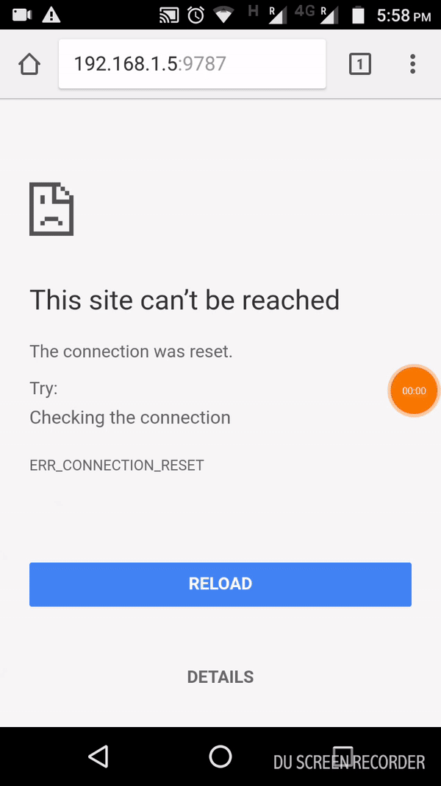

# Parkinson: A Self Diagnosis Toolkit




## A web-app designed to aid self-diagnosis for individuals worried that something might be amiss. Still in the nascent stages of development.

### How to run?
- First run the server.py file in the server directory
- Then, find out the ```Ipv4``` address of the current wifi connection you are using from your laptop
- Preferably use a smartphone for this step. Go to Chrome and type in ```https://your-ip-address:9787``` (The port address is 9787)
- All set!

###### This was the winning app for the [Practo Sandbox Hackathon 2017](https://blog.practo.com/practo-brings-sandbox-hackathon-2017/), created along with my team members [Karan](https://github.com/karanchahal) and [Vaibhav](https://github.com/Vaibhav117)
